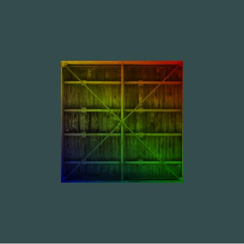
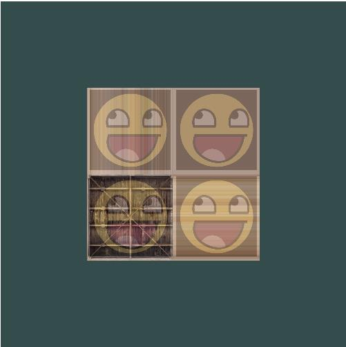

## 2.1.hello_triangle 画一个三角形

## 2.2.hello_triangle_index 画矩形
1. gl.TRIANGLES 画三角形

2. gl.LINE_LOOP 画回路
  

## 2.3.hello_triangle_exercise1 绘制两个彼此相连的三角形

 

## 2.4.hello_triangle_exercise2 使用不同的VAO和VBO绘制两个三角形

## 2.5.hello_triangle_exercise3 使用两个着色器程序绘制两个不同颜色的三角形

## 3.1.shader_uniform uniform输入颜色值

## 3.2.shaders_interpolation 三个顶点不同颜色，颜色插值

## 3.4.shaders_exercise1 修改着色器使三角形上下颠倒

## 4.1.textures 纹理

## 4.2.textures_and_color 片段着色器中增颜色值

## 4.3.textures_combine 多个纹理结合

## 4.4.textures_combine_exercise1 修改片段着色器，仅让笑脸图案朝另一个方向看

## 4.5.textures_combine_exercise2 设置纹理坐标范围为(0,0)到(2,2)，并设置不同环绕方式
### 1. gl.REPEAT 与 gl.MIRRORED_REPEAT

### 2. gl.CLAMP_TO_EDGE

## 4.6.textures_combine_exercise3 修改纹理坐标让矩形只显示纹理图像的中间一部分，并使用gl.NEAREST的纹理过滤方式。

